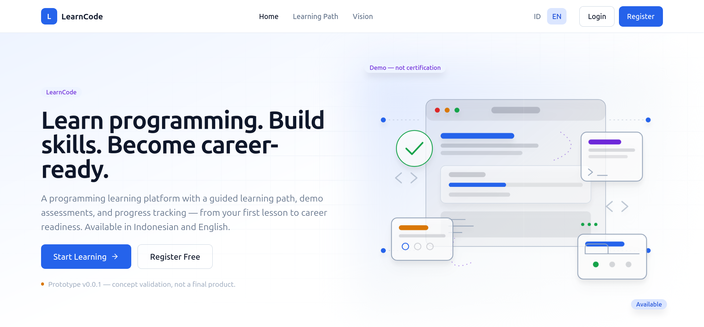
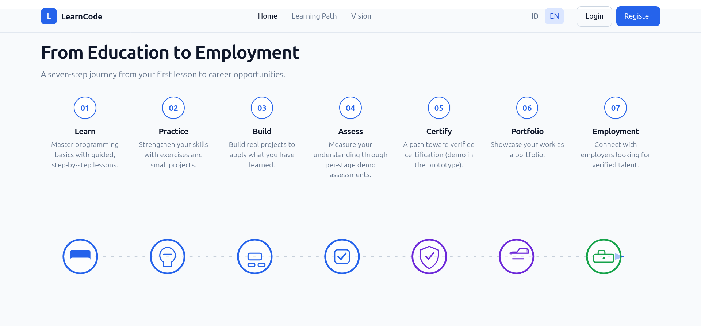
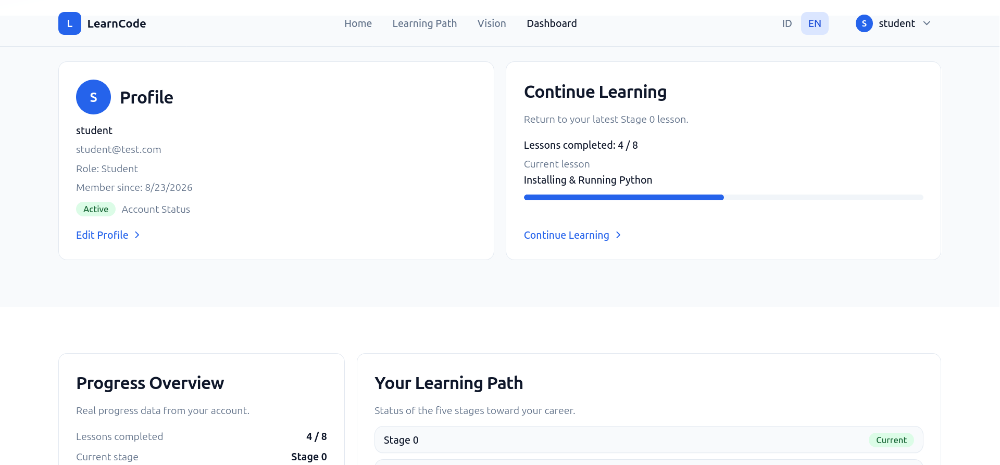

# LearnCode

> Learn programming. Build skills. Become career-ready.

LearnCode is a programming learning platform prototype — build skills
and become career-ready. Available in Indonesian and English. Prototype v0.0.1 — M00–M25 implemented: content, auth,
progress, admin, and deployment preparation.

## Screenshots

### Home



The home page presents the product tagline — **"Learn programming. Build skills.
Become career-ready."** — alongside two primary calls to action: **Start Learning**
(for visitors who already have an account) and **Register Free** (for new users).
The hero illustration depicts a stylized coding interface with module cards and
an "Available" status badge. A small **"Prototype v0.0.1 — concept validation, not
a final product."** disclaimer is intentionally visible to keep the scope honest.
The site header carries the **LearnCode** wordmark, primary navigation
(Home, Learning Path, Vision, Dashboard), and a language switcher (**ID / EN**)
that routes the user between Indonesian and English locales. Captured at
1920×894 viewport, English locale, logged-out state.

### Vision



The Vision page sketches LearnCode's positioning as **"From Education to
Employment"** — a seven-step learner journey: **Learn**, **Practice**, **Build**,
**Assess**, **Certify**, **Portfolio**, and **Employment**. Each step has a short
descriptor of what the learner does at that stage (e.g. *Practice* —
"Strengthen your skills with exercises and small projects."). Below the
descriptions, a horizontal connector links the seven steps with iconified
milestones (lightbulb, code window, checklist, shield, briefcase, briefcase)
that transition from blue (foundation steps) to purple (career steps) to
green (employment outcome). The screenshot is captured in the **logged-out**
state, so the header shows the **Login** and **Register** buttons instead of
the authenticated user menu.

### Student Dashboard



The authenticated student dashboard is the personal workspace of every learner.
It is intentionally **not** a duplicate of the Learning Path — it is a
**summary surface** that surfaces the most relevant signals at a glance:

- **Profile card** — display name (set in account settings), email, role
  (`Student`), member-since date, and an `Active` account-status pill.
  The "Edit Profile" link points to `/settings`.
- **Continue Learning widget** — links back to the most recent Stage 0
  lesson, with a progress bar (`Lessons completed: 4 / 8` shown here) and
  the current lesson title.
- **Progress Overview** — flat counts from the learner's own record:
  lessons completed, current stage.
- **Your Learning Path snapshot** — a compact view of the five stages with
  a "Current" badge on the active stage (Stage 0 in this capture).

The header now shows the authenticated state: a user avatar with the
display-name initial, language switcher, and a dropdown menu that exposes
Settings, Dashboard, and Logout. Captured at 1920×894 viewport, English
locale, signed in as `student@test.com`.

> Full-resolution copies and additional captions live in
> [`docs/screenshot/`](docs/screenshot/README.md).

## Repository Structure

```
frontend/   Next.js + React + TypeScript + Tailwind CSS (ID/EN locales)
backend/    Python + FastAPI + SQLAlchemy + Alembic
docs/       Source-of-truth documentation (architecture, security, deployment)
```

## Currently Implemented

- Bilingual frontend (`/id`, `/en`) with language switcher: home, vision,
  learning path (Stage 0–4), Stage 0 lessons, demo assessments (Stage 1–4),
  contact, privacy, terms.
- Authentication: register/login/logout/me — PBKDF2 password hashing, HMAC
  session tokens, per-user token revocation, rate limiting, security logging.
- Student dashboard with progress summary.
- Admin area (ADMIN role): dashboard statistics, user list, course/lesson
  management, demo assessment management.
- Backend: `/api/health`, auth, progress, assessment attempts, admin APIs
  (migrated via Alembic, PostgreSQL).
- Docker Compose for `frontend`, `backend`, `postgres` (postgres internal-only).
- Security: secret validation, security headers/CSP, structured security logs,
  dependency audit commands (`make security-audit`).

## Quick Start (development)

```bash
cp .env.example .env          # fill AUTH_SECRET_KEY (min 32 chars)
docker compose up -d --build
docker compose run --rm backend alembic upgrade head
# frontend: http://localhost:3000  backend: http://localhost:8000
```

## Deployment

> **Deployment scope: private staging only.**
> This repository is a private staging deployment, not public production.
> It runs on plain HTTP, uses bearer tokens in `localStorage`, and stores
> secrets in a local `.env`. Do not expose this stack to the public internet.

For staging deployment, environment variables, backups, rollback, and the
full list of production blockers, see
[docs/DEPLOYMENT.md](docs/DEPLOYMENT.md). Production blockers — TLS,
HttpOnly cookie sessions, production secret manager, dependency
remediation, reverse proxy hardening — are enumerated there.

## Documentation

- [Architecture](docs/ARCHITECTURE.md)
- [Security](docs/SECURITY.md)
- [API Specification](docs/API_SPECIFICATION.md)
- [Database Design](docs/DATABASE_DESIGN.md)
- [Roadmap](docs/ROADMAP.md)

## Requirements

- Docker with Docker Compose plugin (recommended)
- Node.js 20+ and npm (for running the frontend without Docker)
